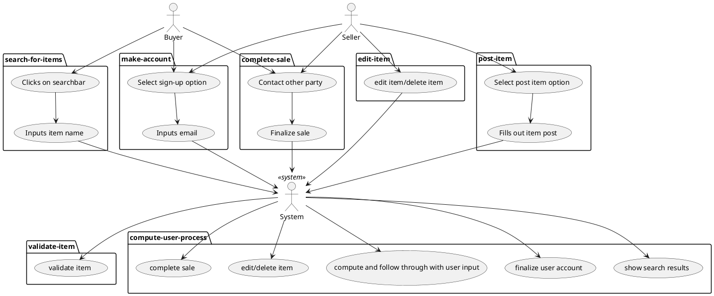
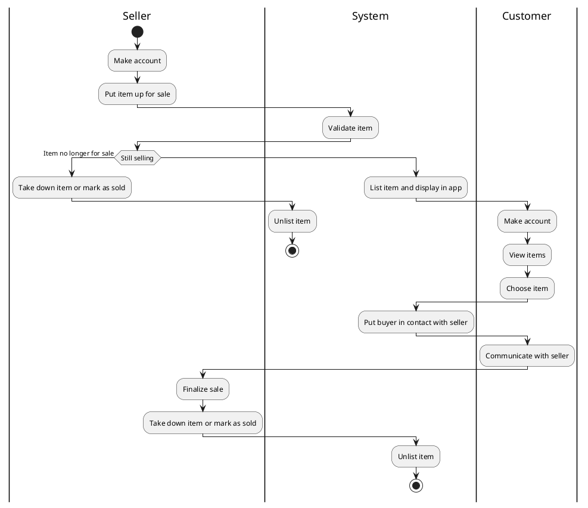

# Target Audience
The target audience for the Vassar Marketplace app is the Vassar student body

# Value Proposition
Vassar Marketplace saves Vassar students time and money by allowing users to buy and sell extra textbooks and
dorm room items instead of buying them retail or throwing them away.  

# Main Features and Constraints:
### Main Features:
- Ability to post extra items you brought to school or past textbooks
- Freedom to choose preferred method of communication
- Ability to search for wanted dorm room items or textbooks for upcoming 
classes
- Once you find an item you want, you will be given their contact 
information 

### Constraints:
- Not able to message the seller directly through the Marketplace : 
must communicate with the seller through provided contact information 
- Sellers must remove the listing from the website once it's sold
- Implementation constraints:
  - from CMPU-102 we have learned java, and therefore within CMPU-203
there is a requirement for the product to be written in java
  - there is a requirement for the product to be an Android Application, based
on what we are learning as a class

# Actors and Goals
Customer:
- open the app
- browse items available
- search items
- pick item
- purchase item
- get in contact with seller

Seller:
- post an item
- edit their items
- receive messages from buyer
- take down items/mark them as sold

# Use Case

###  Primary actor and goals:
- Vassar students who want to buy goods on the marketplace.  To do so, they would like an easy search process and the
  ability to contact sellers

### Other stakeholders and interests:
- **Seller:** Wants to easily post goods they're interested in selling and to be contacted once someone shows interest.  Also wants
  to easily remove an item posted once it's sold

### Preconditions:
- All customers and sellers have created an account with their Vassar email address with synced vassar one login

### Postconditions:
- Buyer is provided seller's email to contact them
- System takes item down once seller says item is sold

